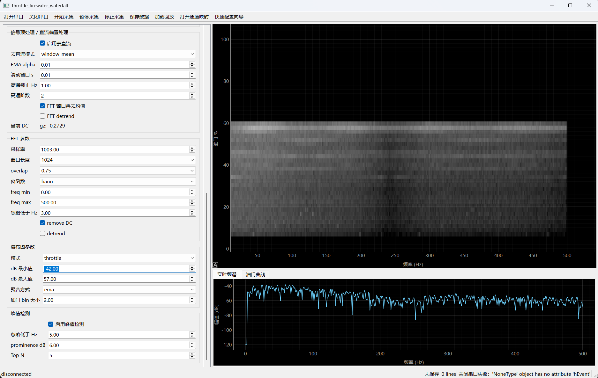
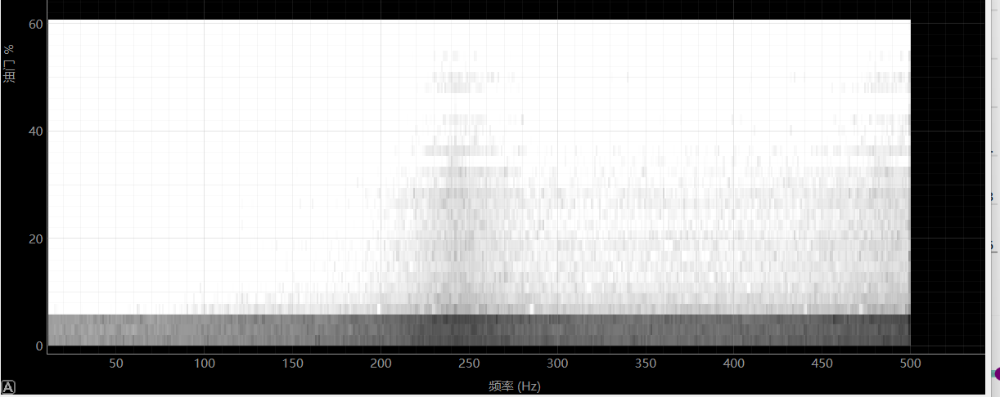

# throttle_firewater_waterfall

`throttle_firewater_waterfall` 是一款面向串口振动分析的桌面工具。它通过 VOFA+ FireWater 文本协议接收油门、IMU、陀螺仪或其他振动数据，实时完成通道映射、直流偏置处理、FFT 分析、峰值检测，并生成油门-频率-能量瀑布图。项目适合用于电机噪声、车架共振、负压系统振动、结构响应等场景的调试与记录。

软件尽量保持输入协议简单、配置过程直观。FireWater 每一行只需要提供一组数字，字段含义可以在图形界面中完成映射，无需修改程序代码。没有硬件时，也可以启用模拟数据模式，快速了解瀑布图、实时频谱和油门曲线的显示方式。

## 项目 Description

`throttle_firewater_waterfall` 是一个基于 PySide6 的实时串口频谱分析工具，面向需要观察“油门变化下振动频率响应”的调试场景。软件支持 VOFA+ FireWater 文本数据流，能够把普通 CSV 风格串口数据映射为油门、IMU、陀螺仪、振动等通道，并在采集过程中进行去直流、窗口 FFT、瀑布图聚合和峰值检测。用户可以通过界面配置字段含义、采样率、FFT 窗口、dB 显示范围、油门 bin 大小和峰值检测参数；也可以保存原始日志、频谱矩阵和瀑布图结果，便于复盘与报告整理。项目适合无人机、机器人、小型电机系统、负压装置、结构振动测试等需要快速定位频率特征的场景。

## 界面预览



同一组瀑布图数据在不同 dB 显示范围下会呈现不同层次。下面这张图为调亮 dB 显示范围后的同一油门瀑布图：



## 主要功能

- FireWater 文本串口数据实时采集
- 无硬件模拟数据模式
- GUI 通道映射：字段、角色、单位、比例、偏移、范围检查
- 油门归一化、平滑和时间对齐
- 直流偏置处理：`window_mean`、`running_mean`、`ema`、`highpass`、`detrend`
- 实时 FFT 频谱显示
- 时间瀑布图与油门瀑布图
- dB 显示范围、油门 bin、聚合方式可调
- 峰值检测与 Top N 频率观察
- 原始日志保存、CSV/NPZ 数据导出与回放
- 通道映射配置保存与复用

## 安装与运行

如果本机 Python 环境配置不方便，或安装依赖时遇到问题，可以直接使用发布页提供的 Windows exe 版本。exe 版本已经包含运行所需组件，不需要额外安装 Python、PySide6、NumPy 或其他依赖。

下载后直接运行：

```text
throttle_firewater_waterfall.exe
```

首次启动可能需要等待数秒，这是单文件版本在准备运行环境。若系统安全软件提示未知发布者，请确认文件来源为本项目发布页后再运行。

建议使用 Python 3.11 或更新版本。

```bash
cd throttle_firewater_waterfall
python -m venv .venv
.venv\Scripts\activate
pip install -r requirements.txt
python main.py
```

也可以从项目上一级目录运行：

```bash
python -m throttle_firewater_waterfall
```

## 快速开始

这一节会带你从启动软件到看到第一张瀑布图。建议先用模拟数据跑通流程，再连接真实设备。

### 1. 获取程序

推荐普通用户直接下载 Windows exe 版本：

```text
throttle_firewater_waterfall.exe
```

exe 版本可以独立运行，无需配置 Python 环境。下载后双击启动即可。

如果希望从源码运行，再执行下面的安装步骤。

### 2. 从源码安装依赖

```bash
cd throttle_firewater_waterfall
python -m venv .venv
.venv\Scripts\activate
pip install -r requirements.txt
```

### 3. 启动程序

```bash
python main.py
```

如果你在项目上一级目录，也可以运行：

```bash
python -m throttle_firewater_waterfall
```

### 4. 无硬件快速体验

1. 在左侧串口区域勾选“模拟数据模式”。
2. 点击顶部“开始采集”。
3. 右侧会开始显示油门瀑布图，下方会显示实时频谱。
4. 如果图像过亮或过暗，调整左侧“瀑布图参数”中的 `dB 最小值` 和 `dB 最大值`。

模拟数据会生成一组随油门变化的振动信号，用来展示电机基频、倍频、固定频率振动和噪声。默认通道中，`gz` 是主分析通道，`throttle` 是油门通道。

### 5. 连接真实串口

设备需要持续发送 FireWater 文本行，例如：

```text
imu:0.012,-0.003,1.001,0.25,-0.18,12.50,37.0
```

基本步骤：

1. 选择串口号和波特率。
2. 点击“打开串口”或“开始采集”。
3. 确认状态栏中的接收行数在增加。
4. 如果出现新的 `prefix`，按提示打开通道映射。

每一行数据必须以 `\n` 结束，否则解析器会继续等待行结束。

### 6. 配置通道映射

点击“打开通道映射”，为每个字段设置含义。以 `imu:ax,ay,az,gx,gy,gz,throttle` 为例：

- `gz`：角色设为 `fft_primary`
- `throttle`：角色设为 `throttle`
- 油门单位为百分比时，输入范围可设为 `0` 到 `100`
- 油门单位为 PWM 时，例如 `1000-2000 us`，输入范围设为 `1000` 到 `2000`，输出范围设为 `0` 到 `100`

应用配置后，后续数据会立即使用新的通道含义。

### 7. 调整显示参数

常用参数建议：

- `采样率`：与设备实际输出采样率一致
- `窗口长度`：常用 `1024` 或 `2048`
- `overlap`：常用 `0.5` 或 `0.75`
- `忽略低于 Hz`：可设为 `2` 到 `5`，减少低频漂移影响
- `dB 最小值 / 最大值`：只影响显示对比度，不改变原始数据
- `油门 bin 大小`：数值越小，油门分辨率越高，但每个 bin 需要更多数据填充

如果瀑布图大面积发白，降低 `dB 最大值` 或提高 `dB 最小值`；如果图像太暗，扩大 dB 范围。

### 8. 保存与回放

1. 点击“保存数据”，选择一个 session 文件夹。
2. 采集过程中会保存原始日志和分析结果。
3. 点击“停止采集”后，频谱和瀑布图文件会写入该文件夹。
4. 后续可点击“加载回放”，选择 `raw_firewater.log` 重新查看。

## FireWater 数据格式

普通采样行格式如下：

```text
prefix:ch0,ch1,ch2,...,chN\n
```

示例：

```text
imu:0.012,-0.003,1.001,0.25,-0.18,12.50,37.0
```

说明：

- `prefix:` 可以省略。
- 每一行必须用 `\n` 结束。
- 字段使用逗号分隔，字段值应为数字。
- `image:` 是 FireWater 图片保留前缀，软件默认识别并忽略。
- FireWater 本身不规定第几个字段是什么物理量，字段含义由通道映射决定。

## 通道映射

点击“打开通道映射”可以配置每个字段的含义。常见设置如下：

- 油门字段：通道名 `throttle`，角色 `throttle`，单位 `%` 或 `us`
- 主分析字段：通道名 `gz` 或其他振动通道名，角色 `fft_primary`
- 可选分析字段：角色 `fft_optional`、`imu_gyro` 或 `imu_acc`

如果油门来自 PWM，例如 1000-2000 us，可在油门配置中设置：

- 输入最小值：`1000`
- 输入最大值：`2000`
- 输出范围：`0` 到 `100`

这样瀑布图的 Y 轴就会按 0-100% 油门显示。

## 瀑布图怎么看

油门瀑布图中：

- X 轴是频率，单位 Hz
- Y 轴是油门百分比
- 颜色深浅表示该油门区间下的频谱能量，单位 dB

常见判断方式：

- 随油门上升而上升的斜线，通常与电机基频有关。
- 更陡的斜线，常见于 2x、3x 等倍频。
- 固定频率附近的水平线，可能来自结构共振或固定转速部件。
- 某段频率整体变亮，可能表示宽带噪声抬升。

dB 最小值和最大值只影响显示对比度，不改变原始分析结果。调亮可以观察弱能量区域，调暗可以突出强能量线条。

## 去直流与低频处理

IMU 和陀螺仪数据常带有直流偏置。如果不处理，0 Hz 附近的能量会很强，瀑布图的动态范围会被压缩。推荐默认设置：

- 启用去直流
- 去直流模式：`window_mean`
- 保留“FFT 窗口再去均值”
- 瀑布图显示时忽略过低频率

当需要观察极低频运动时，可以适当降低忽略频率；当信号存在明显慢漂移时，可以尝试 `highpass`。

## 保存与回放

点击“保存数据”后，选择一个 session 文件夹，软件会保存：

- `raw_firewater.log`：原始 FireWater 文本流
- `channel_mapping_profile.yaml`：当前通道映射
- `session_config.yaml`：当前配置
- `samples.csv`：预处理后的采样数据
- `spectrum.npz`：频谱帧数据
- `waterfall.npz`：瀑布图矩阵

如果采集过程中 FFT 频率轴发生变化，频谱会按组保存为 `spectrum.npz`、`spectrum_001.npz` 等文件。

点击“加载回放”可以选择已有 `raw_firewater.log`，用当前配置重新解析并显示。

## 常见问题

**没有数据怎么办？**  
检查串口号、波特率，以及设备是否发送了以 `\n` 结尾的数据行。

**为什么瀑布图某些油门区间为空？**  
对应油门 bin 中的频谱帧数量不足。可以更慢地扫油门，或调小油门 bin。

**为什么 0 Hz 附近很亮？**  
通常是直流偏置或低频漂移。启用 `window_mean` 或高通滤波后会明显改善。

**为什么调 dB 范围后图像差别很大？**  
dB 范围控制显示映射。较亮设置适合看弱特征，较暗设置适合看强峰值和主线条。

**高采样率下卡顿怎么办？**  
可以减少通道数、减少小数位、提高波特率、增大 FFT 窗口 hop，或降低 UI 刷新压力。

## 测试

```bash
cd throttle_firewater_waterfall
pytest
```

## 打包 Windows exe

项目提供 PyInstaller 配置，可生成单文件 Windows exe：

```bash
cd throttle_firewater_waterfall
.venv\Scripts\python.exe -m pip install pyinstaller
.venv\Scripts\python.exe -m PyInstaller --noconfirm --clean packaging\throttle_firewater_waterfall_onefile.spec
```

生成文件位于：

```text
dist/throttle_firewater_waterfall.exe
```

该 exe 为独立运行版本，适合直接放到 GitHub Releases 中提供下载。

## 开源协议

本项目基于 GNU General Public License v3.0 or later 开源。详见 [LICENSE](LICENSE)。
